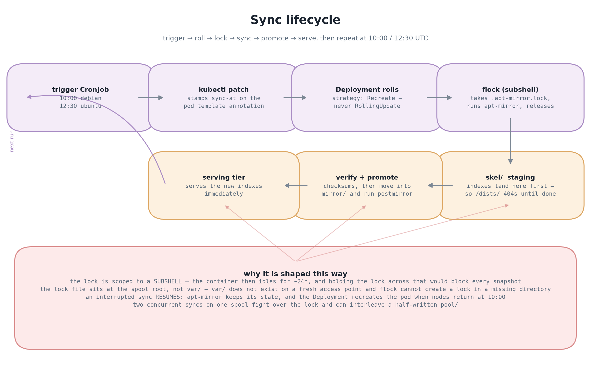

# apt-mirror on EKS

A Debian and Ubuntu package mirror running inside Amazon EKS, with the archive
on EFS and served over the existing ALB + nginx edge. Clients point `apt` at a
mirror instead of reaching the public Debian and Ubuntu archives directly.

| | |
| --- | --- |
| Debian 12 (bookworm) | `https://debian-mirror.azubisuccess.space/debian` |
| Ubuntu 24.04 (noble) | `https://ubuntu-mirror.azubisuccess.space/ubuntu` |
| Frozen snapshots | `https://debian-mirror.azubisuccess.space/snapshots/<name>/debian` |
| Cluster | `eks-lab`, EKS 1.36, `us-west-1` |
| Storage | EFS `archcloud-mirror-efs`, one access point per distro |

## Why it exists

Pulling packages from the public archives is a network dependency you do not
control. A mirror in-cluster makes that fetch local, keeps working when egress
is throttled or blocked, and gives you a version you can pin: a client locked to
a snapshot gets the same bytes tomorrow that it got today.

## Status

Verified against the live cluster on 2026-09-29:

| Check | Result |
| --- | --- |
| `debian/dists/bookworm/Release` | 200 |
| `ubuntu/dists/noble/Release` | 200 |
| Snapshot `20260928-140036Z` Release | 200 |
| Blackbox probes in Prometheus | 4/4 `up` |
| Browser capture (4 pages, TLS valid) | 0 console errors, 0 failed requests |

Reproduce the browser half with `node hack/capture-evidence.mjs`; the raw
capture and screenshots are committed under
[docs/evidence](docs/evidence/README.md).

## Architecture


The request path, end to end:


More detail: [request and sync topology](docs/diagrams/architecture.png) ·
[sync lifecycle](docs/diagrams/sync-lifecycle.png) ·
[secret flow](docs/diagrams/secrets-flow.png). All four are generated by
`python3 hack/diagrams.py`.

## Client configuration

Debian 12:

```
deb http://debian-mirror.azubisuccess.space/debian bookworm main contrib non-free non-free-firmware
deb http://debian-mirror.azubisuccess.space/debian bookworm-updates main contrib non-free non-free-firmware
deb http://debian-mirror.azubisuccess.space/debian-security bookworm-security main contrib non-free non-free-firmware
```

Ubuntu 24.04:

```
deb http://ubuntu-mirror.azubisuccess.space/ubuntu noble main restricted
deb http://ubuntu-mirror.azubisuccess.space/ubuntu noble-updates main restricted
deb http://ubuntu-mirror.azubisuccess.space/ubuntu noble-security main restricted
```

HTTPS works too — the ALB terminates the wildcard `*.azubisuccess.space`
certificate. Clients without a CA bundle can stay on `http://`.

A client pinned to a frozen set:

```
deb http://debian-mirror.azubisuccess.space/snapshots/20260928-140036Z/debian bookworm main contrib non-free non-free-firmware
```

## How it works

Each distro syncs on its own schedule and its own EFS access point, which is
what enforces a single writer per spool — `apt-mirror` takes a `flock` and
refuses to run twice against the same pool. The sync pod stays alive after a
sync, holding the mount warm, until a trigger CronJob patches a `sync-at`
annotation on its Deployment and the pod rolls.



| Job | Schedule (UTC) | State |
| --- | --- | --- |
| Debian 12 sync | 10:00 daily | active |
| Ubuntu 24.04 sync | 12:30 daily | suspended — enable to start syncing |
| Snapshot | 12:30 daily | suspended — run by hand |

Ubuntu is staggered off the Debian slot so the two do not contend for the same
node bandwidth. Both are on EFS-backed static PVs, so turning compute off does
not lose data.

## Design decisions

Each is an ADR, because the short version is usually the wrong one:

- **[0001](docs/adr/0001-kustomize-overlays.md) Kustomize overlays** — no Helm, no
  Argo. A render is readable YAML.
- **[0002](docs/adr/0002-alloy-over-node-exporter.md) Alloy over node_exporter** —
  one DaemonSet instead of a scrape job per node.
- **[0003](docs/adr/0003-efs-for-grafana.md) EFS for Grafana** — survives node churn
  without a database.
- **[0004](docs/adr/0004-push-gitops-least-privilege.md) Push-based GitOps with least
  privilege** — CI may only touch `apps/` and `envs/`; cluster-scoped and
  Helm-managed state is applied by a human. Costs reconciliation, buys a small
  blast radius.
- **[0005](docs/adr/0005-static-pv-per-efs-access-point.md) A static PV per EFS access
  point** — the access point *is* the write boundary, so it is in the volume
  rather than in a convention.
- **[0006](docs/adr/0006-hardlink-snapshots.md) Hardlink snapshots** — `cp -al` costs
  no bytes, so a 127 GB apparent snapshot added 0. It is not free: ~22 minutes
  of EFS metadata work, and each retained snapshot pins whatever later syncs
  replaced.

## Operating notes

**Compute is off every night.** The node group terminates at 17:58 UTC and
returns at 10:00, so endpoints answer `502` overnight and a sync in progress
resumes the next morning rather than restarting — `apt-mirror` keeps its state on
the spool. This is a cost decision, not an oversight.

**The cluster is at its pod ceiling.** 5 nodes × 11 = 55 slots, and the
day-time cluster sits at 55. Every workload therefore runs a single replica, and
monitoring rollouts use `maxSurge: 0`. A second replica does not fail over
gracefully here — it simply cannot schedule, and it starves whatever pod is
next in line. Scale the node group first.

**Signature verification is unchanged.** `apt-mirror` imports the upstream keys
into its own keyring and clients keep verifying `Release`. Nothing sets
`trusted=yes`, and `apt-mirror.conf` never runs the
`Acquire::AllowInsecureRepositories` path.

Full guide, including the failure modes worth knowing before you hit them:
**[docs/mirror.md](docs/mirror.md)**.

## Repository layout

```
apps/
  mirror/       the product: sync, snapshots, serving tier, image build context
  nginx/        public edge — host-based vhosts, the ALB Ingress
  monitoring/   Prometheus, Grafana, Loki, Alloy, blackbox probes
  alb/          ALB controller service account (IRSA)
envs/{dev,prod}/  the only directories CI deploys
platform/         cluster-scoped: PVs, deploy ClusterRole, trigger RBAC — BY HAND
infra/            Helm releases and the nightly node scheduler — BY HAND
terraform/        VPC and EKS. Not in CI
docs/             operating guide, architecture, ADRs, diagrams, evidence
hack/             diagram generator, evidence capture
```

## Contributing

- Manifests carry no comments. The reasoning lives in `docs/mirror.md` and
  `docs/adr/`; `hack/strip-manifest-comments.py` keeps that auditable.
- No floating tags: CI fails on `:latest`, and every image is pinned by digest
  except the serving tier's `nginx:1.27-alpine`.
- A new app directory must be referenced from an `envs/*/kustomization.yaml`.
  Kustomize is not a recursive walker, so an unreferenced directory deploys
  nothing while CI stays green.
- `terraform/` is intentionally out of CI. It mirrors live infrastructure and is
  run by an admin.

MIT licensed. See [CONTRIBUTING.md](CONTRIBUTING.md) and
[SECURITY.md](SECURITY.md).
