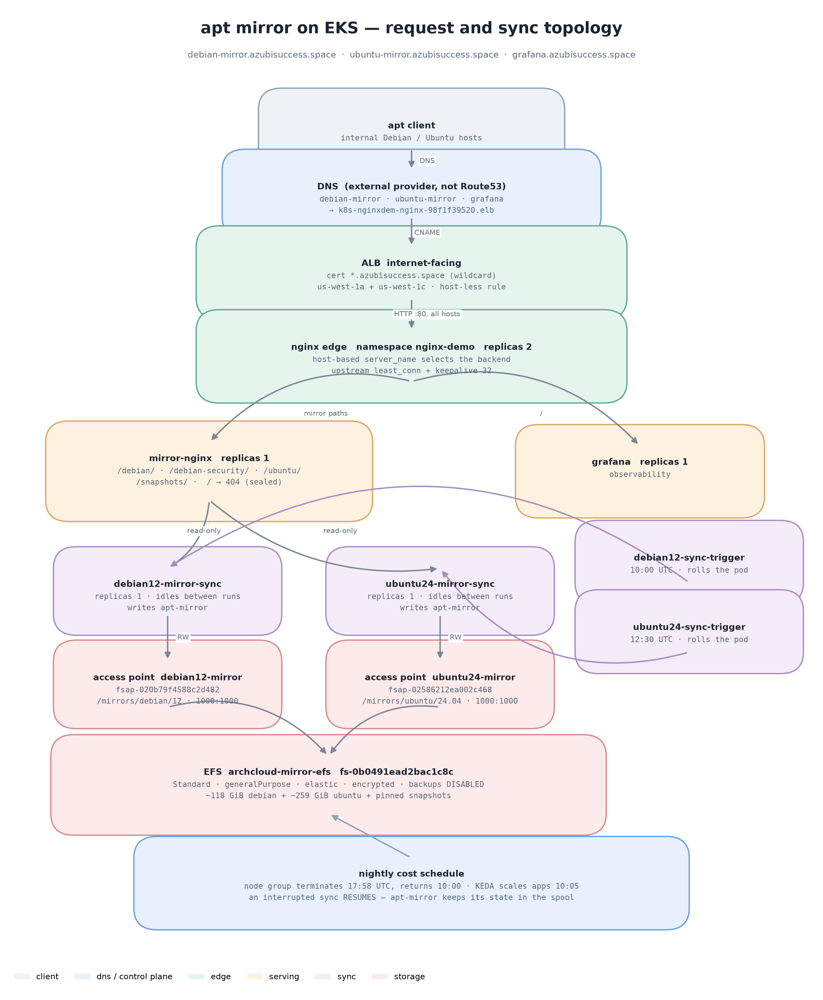

# Architecture



<p align="center"><em>Regenerate with <code>python3 hack/diagrams.py</code></em></p>

## Distro shape

The two distros are not symmetric, and the difference is the single most
important thing to know about this system.

| | Debian 12 | Ubuntu 24.04 |
|---|---|---|
| archive root | `deb.debian.org/debian` | `archive.ubuntu.com/ubuntu` |
| security | **separate** root, `/debian-security` | **same** root, `dists/noble-security` |
| dists | bookworm, bookworm-updates, bookworm-security | noble, noble-updates, noble-security |
| components | main, contrib, non-free, non-free-firmware | main, restricted |
| served at | `/debian/`, `/debian-security/` | `/ubuntu/` |
| archive size | ~118 GiB | ~259 GiB |

Ubuntu carries only `main` + `restricted`. Adding `universe` and `multiverse`
roughly doubles the archive for packages a controlled internal estate rarely
needs; `noble` with all four components is available upstream if that changes.

## Serving

One `mirror-nginx` serves both distros. It mounts each distro's PVC read-only
and aliases the archive path per distro:

```
/debian/          →  /srv/apt-mirror/mirror/deb.debian.org/debian/
/debian-security/ →  /srv/apt-mirror/mirror/security.debian.org/debian-security/
/ubuntu/          →  /srv/ubuntu/mirror/archive.ubuntu.com/ubuntu/
/snapshots/       →  /srv/apt-mirror/snapshots/
/                 →  404
```

The extra `mirror/` path segment is not a mistake. apt-mirror writes to
`$base_path/mirror/<host>/<root>/`, so from the serving container the archive
really is one level deeper than the client URL suggests. Getting this wrong is a
404 on every package path.

`/` returns 404 deliberately: the spool root holds `mirror/`, `skel/`, `var/`
and autoindexing it would publish the whole layout to anyone who resolved the
hostname.

The edge proxy adds one vhost per hostname, each with an explicit `upstream`
(`least_conn`, `keepalive 32`) pointing at the single ClusterIP Service.
Balancing across the serving pods is kube-proxy's job; `least_conn` only
becomes meaningful if the serving tier is ever scaled past 1.

## Storage

One EFS filesystem, **one access point per distro**, one static PV each.

| distro | access point | root | POSIX |
|---|---|---|---|
| Debian 12 | `fsap-020b79f4588c2d482` | `/mirrors/debian/12` | 1000:1000 |
| Ubuntu 24.04 | `fsap-02586212ea002c468` | `/mirrors/ubuntu/24.04` | 1000:1000 |

Binding is static, and the reason is not stylistic — dynamic provisioning is
IAM-blocked on this cluster. See
[ADR-0005](adr/0005-static-pv-per-efs-access-point.md).

The access point forces POSIX 1000:1000 on every request regardless of the
client uid, so the sync containers can run as root and the serving container
runs as uid 101 and still reads everything. Dirs are 0755 and files 0644, which
is what makes a non-root nginx work here.

## Sync

Each distro has an independent sync Deployment, trigger CronJob, ConfigMap and
access point. They share only the serving tier.

- Schedule: Debian 10:00, Ubuntu 12:30 UTC. Staggered so they do not contend.
- The trigger patches a `sync-at` annotation, which rolls the pod. The new pod
  syncs, then idles holding the mount warm.
- `strategy: Recreate` — never RollingUpdate. The spool is single-writer and two
  apt-mirror processes on one EFS tree will interleave a half-written `pool/`.
- A `flock` on `/var/spool/apt-mirror/.apt-mirror.lock` serialises sync against
  snapshot.

## Observability

`monitoring` holds Grafana (1 replica), Prometheus on EFS, Loki, blackbox
exporter and an Alloy DaemonSet. It exists to watch the mirror and the edge —
there is no demo workload left. The mirror endpoint probe list is in
`apps/monitoring/base/prometheus-config.yaml`.

## Deliberate constraints

- **5 nodes, 55 pod slots, 54 in use.** Everything about the replica counts
  follows from this.
- **No dedicated node group for the mirror.** It shares `ng-eks` (t3.small) and
  therefore inherits the nightly scale-to-zero and the pod ceiling.
- **Standard EFS with 2 mount targets and backups disabled.** One Zone with a
  single mount target would be roughly a quarter of the storage cost and would
  avoid cross-AZ egress, but it means re-syncing ~360 GiB.
- **Snapshots cover Debian only.** Ubuntu's spool is a separate filesystem and
  one nginx `alias` cannot span two roots.
