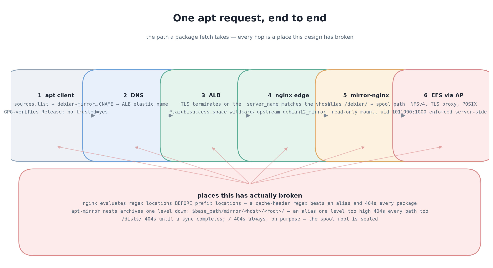

# Debian/Ubuntu apt mirror — operating guide

How the mirror works, and the failure modes that are easy to reintroduce. The
manifests are deliberately comment-free; everything that used to be a comment
in them lives here.

## Shape

Two facts about this shape are load-bearing:

**apt-mirror nests its archives one level down.** It writes to
`$base_path/mirror/<host>/<root>/`, so from the serving container the real path
is `<mount>/mirror/deb.debian.org/debian/`, not `<mount>/deb.debian.org/debian/`.
Getting this wrong is a 404 on every package path, not a partial failure. The
nginx aliases encode the extra `mirror/` segment for exactly this reason.

**The two distros are not interchangeable.** Debian keeps its security suite
under a *separate* archive root; Ubuntu does not:

| | main | updates | security |
|---|---|---|---|
Debian | `deb.debian.org/debian` | same root | `security.debian.org/**debian-security**` — a different root |
Ubuntu | `archive.ubuntu.com/ubuntu` | same root | `archive.ubuntu.com/ubuntu/dists/noble-security` — the **same** root |

A mirror.list that lists `bookworm-security` under `deb.debian.org/debian`
returns 404 and **aborts the entire sync**, not just that suite. This is not
hypothetical: it is why the first mirror image never completed a run. Ubuntu has
no such trap, which is why one root and three dists is correct there.

## Signatures

apt-mirror verifies `InRelease`/`Release` with gpgv. In a container `~/.gnupg`
is empty, so without an explicit keyring every dist fails with
`Can't check signature: No public key`.

Each distro's `apt.conf` therefore sets:

    signed-by=/usr/share/keyrings/<distro>-archive-keyring.gpg;

and the image must actually ship that keyring (`debian-archive-keyring`,
`ubuntu-keyring`) plus `xz-utils` for the `.xz` Release files.

## Storage

Binding is **static** — a PV per access point with an explicit `volumeHandle`,
and the PVC pre-binds by `volumeName`. This is not a style preference; dynamic
provisioning cannot work on this cluster:

    not authorized to perform: elasticfilesystem:DescribeAccessPoints
      as AmazonEKSPodIdentityAmazonEFSCSIDriver-efs-csi-controller-sa-Rol

The EFS CSI driver is EKS addon-managed and authenticates through addon-owned
Pod Identity associations, which take precedence over the service account's IRSA
annotation. The addon role lacks `DescribeAccessPoints` and `CreateAccessPoint`,
so `provisioningMode: efs-ap` fails on every attempt and the PVC sits `Pending`
forever. A correctly-permissioned IRSA role exists and is never used.

Consequences of static binding:
- The StorageClass is only read for the binding match; the `accessPointId`
  parameter in it is **inert**. Keep it for documentation, not function.
- `StorageClass.parameters` is `map[string]string`. A nested
  `provisioningParameters: {accessPointId: …}` is rejected by the API server
  with a type error; the key must be flat and dotted.
- `spec.capacity.storage` is cosmetic. EFS has no quota, so a PVC's reported
  size never reflects real usage — use `du -sh` on the mount.
- **One PV per access point, never two.** Two PVCs sharing a `volumeHandle`
  share a tree and corrupt each other.

## Single writer

The spool is single-writer. Two apt-mirror processes on one EFS tree fight over
the lock and can interleave a half-written `pool/`.

Both syncs therefore use `strategy: Recreate`, not RollingUpdate. A rolling
update would briefly run two pods — the exact failure being prevented.

Snapshot jobs serialise against syncs with `flock` on
`/var/spool/apt-mirror/.apt-mirror.lock`. Two details that are easy to get wrong:

- The lock is taken in a **subshell** around `apt-mirror` only. The sync
  container idles with `exec sleep infinity` between runs; holding the lock
  across that idle period would block every snapshot for ~24h.
- The lock file lives at the **spool root**, not `var/`. `var/` does not exist
  on a fresh access point and `flock` cannot create a lock file in a missing
  directory.

`flock` over this EFS NFSv4 mount was verified to acquire, block and release
correctly rather than assumed.

## Scheduling

The cluster scales to zero: the node group terminates at **17:58 UTC** and
returns at **10:00**, and KEDA scales apps up at 10:05. Anything scheduled
inside that window has nowhere to run and sits `Pending` until morning.

| job | time (UTC) | why there |
|---|---|---|
Debian sync trigger | 10:00 | first slot after nodes return |
Ubuntu sync trigger | 12:30 | staggered so the two syncs do not contend |
Snapshot | 12:30 | after the syncs, well clear of the 17:58 drain |

An earlier 02:00 schedule is what made the first CronJob useless.

The sync Deployments **idle** rather than exit. Exiting would make the
Deployment restart the pod in a tight loop and re-pull the EFS mount every
minute; idling keeps the mount warm. A run that ends is a completed run, and
the next trigger rolls the pod to start a new one.

## First sync: expect 404s until it finishes

`/pool/` appears within seconds of a sync starting, but **`dists/` does not**.
apt-mirror downloads index files into `$base_path/skel/` and only promotes them
into `mirror/` once the whole archive has been fetched. So during a first sync:

    /debian/pool/...   -> 200
    /debian/dists/...  -> 404   (normal, not a misconfiguration)

This looks exactly like the alias-path bug and is not. Do not "fix" the nginx
alias in response to a `dists/` 404 while a sync is running — check whether a
sync is in flight first. A sync is:

    kubectl -n mirrors logs deploy/<distro>-mirror-sync --tail=5

Once it completes, `dists/` appears and the endpoint serves indexes. Debmirror
behaved the same way; this is apt-mirror's staging, not ours.

## Snapshots

See [ADR-0006](adr/0006-hardlink-snapshots.md). In short: `cp -al` creates
hardlinks, so a ~67k-file snapshot costs no bytes but ~22 minutes of EFS
metadata operations, and each retained snapshot **pins** whatever the live
mirror has since replaced.

## Capacity

The node group is at its pod ceiling: **5 nodes × 11 = 55 allocatable slots**.
`kubectl get deploy,ds -A` summing near 55 means the next rollout fails with
`Too many pods`. This is why the serving tier is `replicas: 1`, why Grafana runs
a single replica, and why `prometheus`/`loki`/`blackbox` use `maxSurge: 0`.

## Gotchas that cost real time

- **KEDA overwrites `Deployment.replicas`.** If a ScaledObject targets a
  Deployment, the HPA resets `spec.replicas` from the cron trigger every
  morning. Editing `replicas:` in the manifest does nothing. The ScaledObject
  is the source of truth.
- **nginx evaluates regex locations before prefix locations.** A
  `location ~* \.(deb|xz|gz)$` block for cache headers will beat a
  `location /debian/ { alias … }` block and resolve against `root` instead,
  404ing every package. Do not add one; put caching in the edge proxy, where
  the URI is passed through unchanged either way.
- **`ContainerPort` has no `containerName` field.** It is `name`. The API
  server rejects the entire Deployment on a strict-decode error, and
  `kubectl apply --dry-run=client` will not catch it — only
  `--dry-run=server` does.
- **A RoleBinding's `roleRef` must exist at creation.** `deploy.yml` runs
  `kubectl diff` before applying, and diff dry-run-creates each object in
  isolation, so a RoleBinding whose Role does not exist yet makes diff exit 2
  and the whole deploy dies before applying anything. That is why the sync
  trigger's RBAC lives in `platform/` and is applied by hand.
- **An unreferenced directory renders as zero objects, silently.** Kustomize is
  not a recursive walker. A new app that no kustomization lists deploys
  nothing while CI stays green. Check with
  `kubectl kustomize envs/dev/ | grep -c '^kind:'`.
- **A plain ConfigMap does not trigger a rollout.** `mirror-nginx-conf` is not
  generated by `configMapGenerator`, so editing it leaves the running pod on
  its startup config until you restart it. The edge proxy is unaffected —
  `nginx-sites` is a generated ConfigMap, so its name changes and a rollout
  follows automatically.
- **Client-side dry-run proves nothing about schema.** Two of the bugs above
  passed `kustomize build` and `--dry-run=client` and were only caught by a
  real request or a server-side dry-run.

## Operating

    # what is the mirror serving right now
    kubectl -n mirrors get deploy,pod,svc
    curl -sSI https://debian-mirror.azubisuccess.space/debian/dists/bookworm/Release

    # is a sync running or stuck
    kubectl -n mirrors logs deploy/debian12-mirror-sync --tail=40
    kubectl -n mirrors exec deploy/debian12-mirror-sync -- \
      sh -c 'for p in /proc/[0-9]*; do tr "\0" " " < $p/cmdline 2>/dev/null | grep -q apt-mirror && grep ^wchar $p/io; done'

    # how much is actually on the spool
    kubectl -n mirrors exec deploy/debian12-mirror-sync -- du -sh /var/spool/apt-mirror

`wchar` from the apt-mirror process is the only reliable progress signal. EFS
reports `SizeInBytes` as a daily average on a ~15-minute refresh, so it looks
flat between updates and will mislead you.

Egress note: EFS mount targets exist in both `us-west-1a` and `us-west-1c`, and
`ng-eks` spans both. A node talking to the mount target in the other AZ pays
$0.01/GB. One Zone in a single AZ would avoid it.
